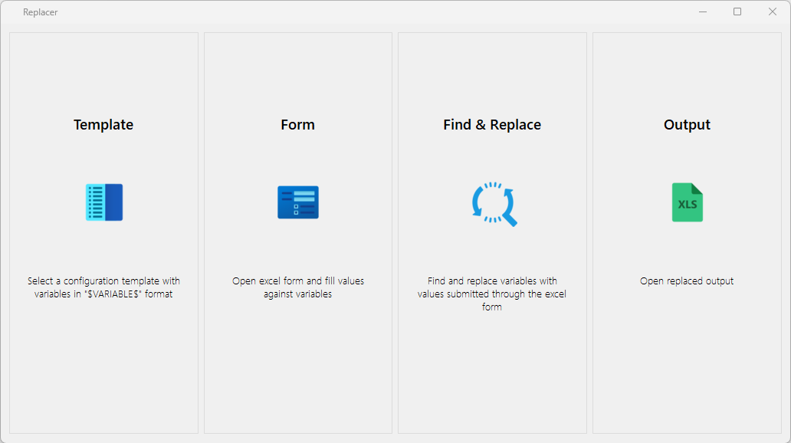

# Replacer

## Overview
**Replacer** is a tool designed to replace variables within a configuration template using multiple instances of values, generating final configurations efficiently.

## Features
- Supports configuration templates with placeholders in `$VARIABLE$` format.
- Uses an Excel form to map values to variables.
- Performs bulk find-and-replace operations.
- Generates final configuration files based on variable replacements.
- Provides an easy-to-use interface for managing templates and values.

## Migration Lifecycle
- Pre-Migration

## Usage
**Select a Template:**  
- Choose a configuration template containing variables in `$VARIABLE$` format.

**Fill the Excel Form:**  
- Open the provided Excel sheet.  
- Populate values corresponding to each variable.

**Find & Replace:**  
- Process the template with values from the Excel form.  
- Replace variables dynamically.

**View and Export Output:**  
 - Open the replaced output file.  
- Validate and use the final configuration.

## Tags
`#ConfigurationAutomation` `#FindAndReplace` `#PreMigration` `#TemplateProcessing`

## Screenshots
